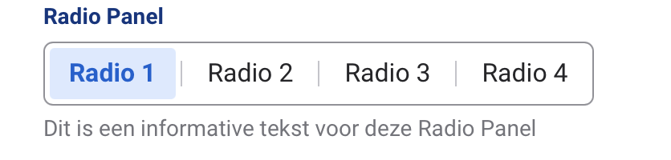

# BT

Bronnlijst
* https://medium.com/@dimterion/multi-step-form-with-html-css-javascript-a712dc827cb6 (multipage forms)
* https://tractie.ns.nl/2e23992f3/p/226ce1-tractie--ns-design-system (NS huisstijl)
* https://blue-water-08c39b403.5.azurestaticapps.net/?path=/docs/web-form--docs (Form NS Docs)

Wat heb ik geleerd?
Niet heel veel nieuws, maar het was een goede herhaling

Hoe lang ben ik er mee bezig geweest?
van 12:00-16:00

Wat ga ik morgen doen?
* De andere pagina's de zelfde stijl maken(V)
* Een terug knop maken (V)
* Meer de huistijl toepassen en in de root alle variablen aanmaken voor de styling.(V)
* Tweede pagina maken(X)
* Paterns toepassen(X)

Concept:

Wat heb ik geleerd?
Hoe ik ervoor kan zorgen dat ik met meerdere input velden, een geheel kan maken en de gebruiker naar het volgende tekstvak kan laten gaan met een beetje JS, waar de huistijl staat en die toegepast. Hoe ik een extra button kan toevoegen.

Hoeveel tijd heeft het me gekost:
12:00-15:45

TO DO:
* (Optional)NS API gebruiken en de storingen vermelden(2U)
* Radio buttons omzetten naar de HIG ()(1U)
* Patterns, regex(1U)
* Responsive(1U)
* Progressive disclosure(2U with hidden)